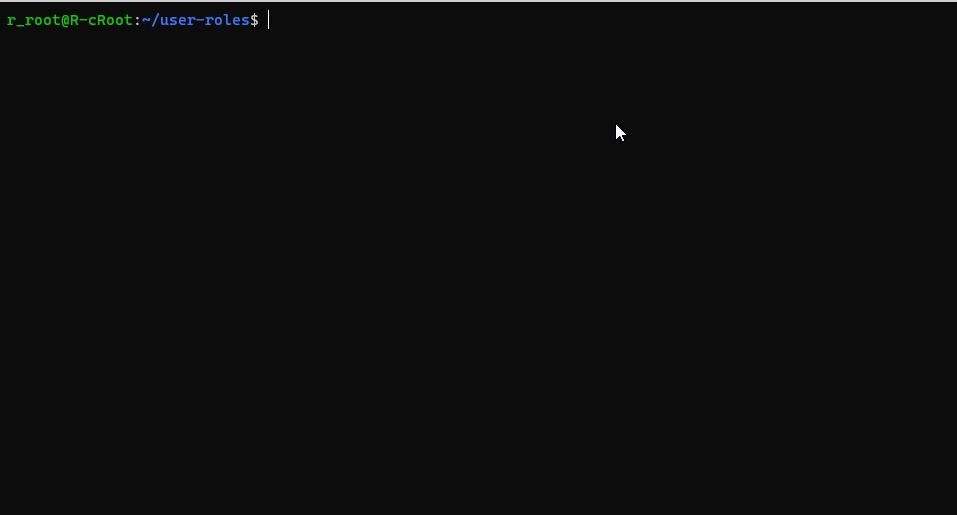
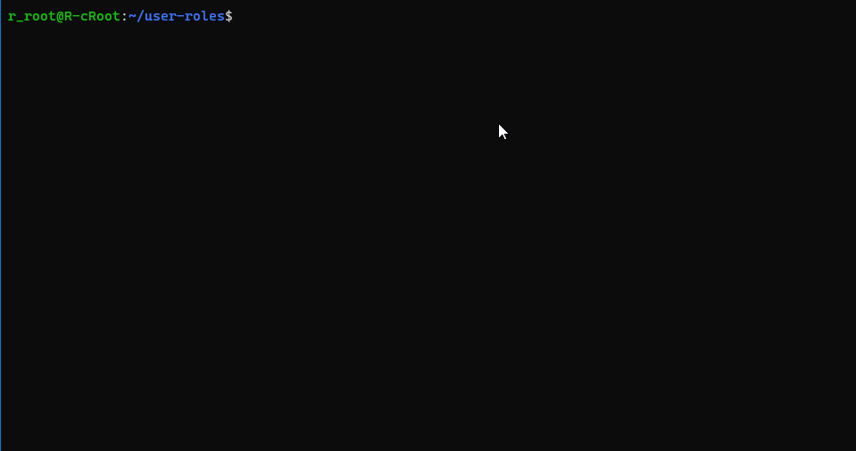

  <h1>User Roles</h1>
  
I was asked to build a docker ready Laravel application where I can create/delete roles and add them to users on a dashboard.

  <h3>
    | <a href="https://app.milanote.com/1Lnman175x8Mdz?p=iNfse5wDigy">Project Management Board</a> |

----
## 🎨 Overview
### ***Commands***: 

  
Create new user

  
Create new role

### ***API Endpoints***:
- Get all roles with their respective carriers: `/api/roles`
- Get all users: `/api/users`

----
## 👨‍💻 Setup
> From now we'll use `./vendor/bin/sail` before commands. You can add it as a alias.`alias sail="./vendor/bin/sail"`

- Clone the project
- Copy the `.env.example` content into a new `.env` file.
  - Check out for the notes on the example.
- Run:
  - Install dependencies with `composer install`
  - Start app with `sail up` and wait until everything has started.
  - Generate unique app key with `sail artisan key:generate`
  - Run migrations to generate tables `sail artisan migrate`
  - Run seeders to generate fake data `sail artisan db:seed`

----
## 🔮 Built With

- PHP
- Laravel
  - Blade (Template Engine)
  - Sail (Docker)
- TailwindCSS
